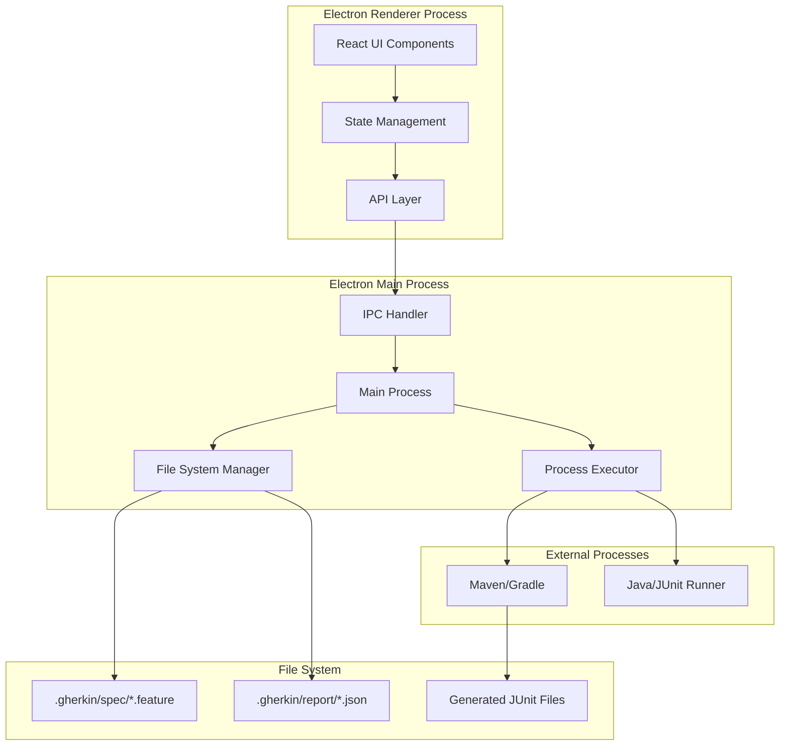
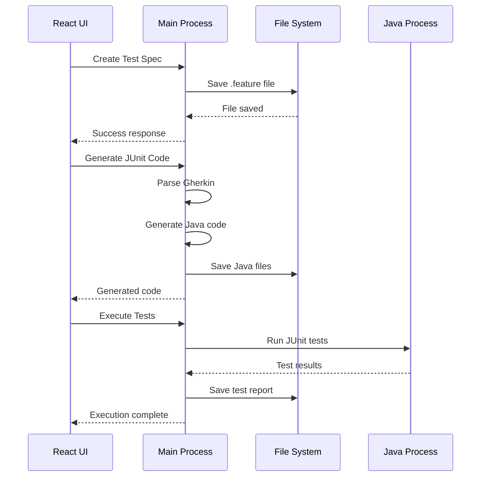

# Design Document

## Overview

Spring BootテストGUIソフトウェアは、Electron + React + TypeScriptで構築されるクロスプラットフォームデスクトップアプリケーションです。Gherkin形式でのテスト仕様記述、JUnitコード生成、テスト実行、結果閲覧を統合的に提供します。

### Key Technologies
- **Frontend**: React 19 + TypeScript
- **Desktop Framework**: Electron 35
- **Build System**: Webpack 5
- **Testing**: Jest + React Testing Library
- **Code Generation**: Custom Gherkin parser + JUnit template engine
- **Process Management**: Node.js child_process for JUnit execution

## Architecture

### High-Level Architecture



### Process Communication Flow



## Components and Interfaces

### Frontend Components

#### 1. Main Layout Components
- **AppLayout**: メインレイアウトコンテナ
- **NavigationSidebar**: 機能間のナビゲーション
- **ContentArea**: メインコンテンツ表示エリア

#### 2. Specification Management Components
- **SpecificationList**: テスト仕様一覧表示
- **SpecificationEditor**: Gherkin仕様エディタ
- **SpecificationViewer**: 仕様の読み取り専用表示

#### 3. Code Generation Components
- **CodeGenerator**: JUnitコード生成インターフェース
- **CodePreview**: 生成されたコードのプレビュー
- **CodeExporter**: コードのエクスポート機能

#### 4. Test Execution Components
- **TestRunner**: テスト実行コントロール
- **ExecutionProgress**: 実行進捗表示
- **TestConfiguration**: テスト実行設定

#### 5. Report Management Components
- **ReportList**: テストレポート一覧
- **ReportViewer**: 詳細レポート表示
- **ReportAnalytics**: テスト結果分析

### Backend Services (Main Process)

#### 1. File Management Service
```typescript
interface FileManagerService {
  // Specification management
  listSpecifications(): Promise<SpecificationFile[]>;
  loadSpecification(filePath: string): Promise<string>;
  saveSpecification(filePath: string, content: string): Promise<void>;
  deleteSpecification(filePath: string): Promise<void>;
  
  // Report management
  listReports(): Promise<ReportFile[]>;
  loadReport(filePath: string): Promise<TestReport>;
  saveReport(report: TestReport): Promise<string>;
}
```

#### 2. Code Generation Service
```typescript
interface CodeGenerationService {
  parseGherkin(content: string): Promise<GherkinAST>;
  generateJUnitCode(ast: GherkinAST, config: GenerationConfig): Promise<string>;
  validateGeneration(code: string): Promise<ValidationResult>;
}
```

#### 3. Test Execution Service
```typescript
interface TestExecutionService {
  executeTests(config: TestConfig): Promise<TestExecution>;
  getExecutionStatus(executionId: string): Promise<ExecutionStatus>;
  cancelExecution(executionId: string): Promise<void>;
}
```

#### 4. Project Configuration Service
```typescript
interface ProjectConfigService {
  loadProjectConfig(): Promise<ProjectConfig>;
  saveProjectConfig(config: ProjectConfig): Promise<void>;
  validateConfiguration(config: ProjectConfig): Promise<ValidationResult>;
}
```

### IPC Communication Interface

```typescript
// Renderer to Main
interface RendererToMainAPI {
  // File operations
  'file:list-specs': () => Promise<SpecificationFile[]>;
  'file:load-spec': (filePath: string) => Promise<string>;
  'file:save-spec': (filePath: string, content: string) => Promise<void>;
  
  // Code generation
  'code:generate': (specContent: string, config: GenerationConfig) => Promise<string>;
  
  // Test execution
  'test:execute': (config: TestConfig) => Promise<string>; // returns execution ID
  'test:status': (executionId: string) => Promise<ExecutionStatus>;
  
  // Report management
  'report:list': () => Promise<ReportFile[]>;
  'report:load': (filePath: string) => Promise<TestReport>;
}

// Main to Renderer
interface MainToRendererAPI {
  'execution:progress': (executionId: string, progress: ExecutionProgress) => void;
  'execution:complete': (executionId: string, result: TestResult) => void;
  'file:changed': (filePath: string, changeType: 'created' | 'modified' | 'deleted') => void;
}
```

## Data Models

### Core Data Types

```typescript
// Specification related
interface SpecificationFile {
  id: string;
  name: string;
  filePath: string;
  lastModified: Date;
  size: number;
}

interface GherkinFeature {
  name: string;
  description?: string;
  scenarios: GherkinScenario[];
  background?: GherkinBackground;
  tags: string[];
}

interface GherkinScenario {
  name: string;
  steps: GherkinStep[];
  tags: string[];
  examples?: GherkinExamples;
}

interface GherkinStep {
  keyword: 'Given' | 'When' | 'Then' | 'And' | 'But';
  text: string;
  docString?: string;
  dataTable?: string[][];
}

// Test execution related
interface TestConfig {
  specificationPath: string;
  javaClasspath: string[];
  springProfiles: string[];
  jvmArgs: string[];
  environmentVars: Record<string, string>;
  buildTool: 'maven' | 'gradle';
  buildFilePath: string;
}

interface TestExecution {
  id: string;
  specificationPath: string;
  startTime: Date;
  status: 'running' | 'completed' | 'failed' | 'cancelled';
  progress: number;
}

interface TestResult {
  executionId: string;
  totalTests: number;
  passedTests: number;
  failedTests: number;
  skippedTests: number;
  executionTime: number;
  testCases: TestCase[];
}

interface TestCase {
  name: string;
  className: string;
  status: 'passed' | 'failed' | 'skipped';
  executionTime: number;
  errorMessage?: string;
  stackTrace?: string;
}

// Report related
interface ReportFile {
  id: string;
  executionId: string;
  filePath: string;
  timestamp: Date;
  summary: TestSummary;
}

interface TestSummary {
  totalTests: number;
  passedTests: number;
  failedTests: number;
  skippedTests: number;
  successRate: number;
}

// Configuration related
interface ProjectConfig {
  projectName: string;
  projectPath: string;
  buildTool: 'maven' | 'gradle';
  buildFilePath: string;
  javaHome?: string;
  defaultClasspath: string[];
  defaultSpringProfiles: string[];
  codeGenerationTemplates: CodeTemplate[];
}

interface CodeTemplate {
  name: string;
  description: string;
  template: string;
  variables: TemplateVariable[];
}
```

## Error Handling

### Error Categories

1. **File System Errors**
   - ファイル読み書きエラー
   - ディレクトリアクセス権限エラー
   - ディスク容量不足

2. **Parsing Errors**
   - Gherkin構文エラー
   - 不正なファイル形式

3. **Code Generation Errors**
   - テンプレート処理エラー
   - Java構文エラー

4. **Test Execution Errors**
   - Java環境エラー
   - クラスパス設定エラー
   - ビルドツール実行エラー

5. **Configuration Errors**
   - 設定ファイル不正
   - 必須設定項目不足

### Error Handling Strategy

```typescript
interface AppError {
  code: string;
  message: string;
  category: 'filesystem' | 'parsing' | 'generation' | 'execution' | 'configuration';
  severity: 'info' | 'warning' | 'error' | 'critical';
  context?: Record<string, any>;
  timestamp: Date;
}

interface ErrorHandler {
  handleError(error: AppError): Promise<void>;
  showUserNotification(error: AppError): void;
  logError(error: AppError): void;
  recoverFromError(error: AppError): Promise<boolean>;
}
```

### User Error Feedback

- **Toast Notifications**: 軽微なエラーや警告
- **Modal Dialogs**: 重要なエラーや確認が必要な場合
- **Inline Validation**: フォーム入力時のリアルタイム検証
- **Error Boundaries**: React コンポーネントレベルのエラーキャッチ

## Testing Strategy

### Unit Testing
- **Frontend**: Jest + React Testing Library
- **Backend Services**: Jest + Node.js testing utilities
- **Code Generation**: Template output validation
- **File Operations**: Mock file system testing

### Integration Testing
- **IPC Communication**: Main-Renderer process communication
- **File System Integration**: Real file operations with temporary directories
- **External Process Integration**: Mock Java/Maven execution

### End-to-End Testing
- **User Workflows**: Spectron/Playwright for full application testing
- **File Management**: Complete specification lifecycle testing
- **Test Execution**: Mock JUnit execution with sample projects

### Test Data Management
- **Sample Specifications**: Various Gherkin feature files
- **Mock Test Results**: Predefined JUnit execution results
- **Configuration Templates**: Sample project configurations

### Performance Testing
- **Large File Handling**: Performance with large specification files
- **Concurrent Operations**: Multiple test executions
- **Memory Usage**: Long-running application stability

### Testing Tools and Frameworks

```typescript
// Test utilities
interface TestUtilities {
  createMockSpecification(name: string): SpecificationFile;
  createMockTestResult(passed: number, failed: number): TestResult;
  setupTempDirectory(): Promise<string>;
  cleanupTempDirectory(path: string): Promise<void>;
}

// Mock services for testing
interface MockServices {
  fileManager: Partial<FileManagerService>;
  codeGenerator: Partial<CodeGenerationService>;
  testExecutor: Partial<TestExecutionService>;
}
```

この設計では、モジュラーアーキテクチャを採用し、各コンポーネントが明確な責任を持つように構成しています。ElectronのMain/Rendererプロセス分離を活用し、ファイルシステムアクセスや外部プロセス実行はMainプロセスで、UIはRendererプロセスで処理します。
